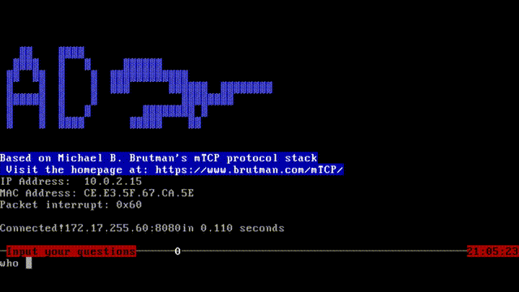
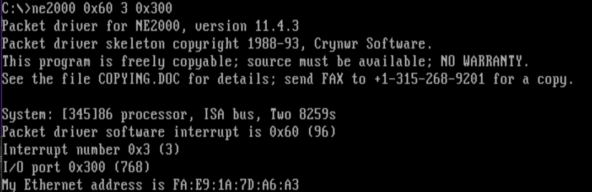

# AI FOR DOS - Using Artificial Intelligence in DOS Systems!

> Run modern AI assistants on traditional MS-DOS operating systems. By communicating with remote servers, DOS users can experience natural language processing capabilities.



## Installation and Usage

### For the Server:

#### First, ensure you have a DeepSeek API key (OpenAI keys should be compatible but untested)

#### You can obtain a key from the [DeepSeek Open Platform](https://platform.deepseek.com/api_keys)

#### Create a `.config.json` file in the server directory with your key, model, temperature, and URL:

```json
{
    "key": "your_api_key_here",
    "model": "deepseek-chat",
    "temperature": 1.0,
    "url": "https://api.deepseek.com/v1/chat/completions"
}
```
#### Then run `./server` on a Linux system. It will listen on port 8080 on all available network interfaces. In my test environment, I used Ubuntu on WSL2.

### For the Client:

#### Your machine needs a network card and corresponding driver

#### Here's an example NE2000 network card driver configuration:

```
ne2000 0x60 3 0x300
```



#### Where `0x60` is the software interrupt number, `3` is the hardware interrupt number, and `0x300` is the network card base address. If a hardware address appears, the driver loaded successfully. If the address is `FF:FF:FF:FF:FF:FF`, the driver failed to load.

#### Since this project is based on mTCP, you need a configuration file specifying the software interrupt (must match the driver interrupt!), IP address, gateway, subnet mask, etc.

#### For this project, you additionally need to specify `ad_ip` and `ad_port`, which correspond to the server's IP address and port.

#### Example configuration file:

```
PACKETINT 0x60
ad_ip 172.17.255.60
ad_port 8080
HOSTNAME_ASSIGNED DOSBox-X
IPADDR 10.0.2.15
NETMASK 255.255.255.0
GATEWAY 10.0.2.2
NAMESERVER 10.0.2.3
LEASE_TIME 86400
```

#### Then specify the configuration file path in DOS:

```
set MTCPCFG=C:\MTCP.CFG

```


#### If you have questions, visit [mTCP TCP/IP applications for DOS PCs](https://www.brutman.com/mTCP/) and read the related PDF for more information.

#### Since I don't have a physical DOS machine, I used DOSBox-X with slirp mode to emulate an NE2000 network card. If you use DOSBox-X, ensure you use the MinGW-built version, otherwise driver loading may fail.

#### After completing these steps, you can launch `ad.exe` to use the program.

### Shortcut Keys
- **Alt+X**: Exit program
- **PgUp/PgDn**: Scroll through context

## Architecture Design

### Client:
#### Based on Michael B. Brutman's mTCP, using TCP protocol to communicate with the server. Features streaming text output, simple UI, and context browsing support.

### Server:
#### Runs on Linux systems, forwards client information to HTTPS servers and relays responses back to clients via TCP. Supports concurrent connections, maintains context, and filters out DOS-incompatible characters.

## Building Guide

### Client:
#### The client is cross-compiled using Open Watcom 1.9 on Windows 11. Navigate to the AD directory and run:
```
wmake
```
#### Note: Do not use Open Watcom 2.0 as it may cause heap corrpution.

### Server:
#### Compile in a Linux environment. You need to install curl dependencies:
```
sudo apt install libcurl-dev
```

#### Ensure curl library is installed, then navigate to the transerver directory and run:
```
make
```
## Acknowledgements

#### *Michael B. Brutman*, developer of **[mTCP TCP/IP applications for DOS PCs](https://www.brutman.com/mTCP/)**.
#### After sharing my ideas and challenges with him, he provided practical advice and motivated me to complete this project.
#### mTCP is **TCP/IP applications for PC-compatible retro computers**.

## Other


#### This logo was designed by DeepSeek-R1. The left side represents the program name (AI for DOS or Ask DeepSeek), and the right side shows a whale spouting water.

# AI FOR DOS - 在DOS系统中使用人工智能!

> 在传统的MS-DOS操作系统上运行现代人工智能助手。通过与远程服务器通信，DOS用户也能体验到自然语言处理的能力。


## 安装与使用

### 对于服务器:

#### 首先确保您有DeepSeek的apikey(OpenAi的key应该也是兼容的,但是未经测试)

#### 您可以在[DeepSeek 开放平台](https://platform.deepseek.com/api_keys)获取一个key

#### 您需要在服务器文件夹下创建一个.config.json文件,在其中输入key,model,temperature,url

#### 以下是一个配置文件示例

```json
{
    "key": "your_api_key_here",
    "model": "deepseek-chat",
    "temperature": 1.0,
    "url": "https://api.deepseek.com/v1/chat/completions"
}
```


#### 然后您需要在Linux系统上运行./server,它将监听所有可用网卡上所有 IPv4 地址的8080端口.在我的测试环境中,使用了WSL2运行的Ubuntu

### 对于客户端:

#### 您的机器需要有一张网卡和相应的驱动

#### 以下是一个ne2000网卡的驱动示例

```
ne2000 0x60 3 0x300
```


#### 其中`0x60`是软件中断号,`3`是硬件中断号,`0x300`是网卡基地址,当跳出硬件地址后,说明驱动加载成功,如果硬件地址是`FF:FF:FF:FF:FF:FF`,说明未能成功加载驱动

#### 由于本项目基于mTCP,您需要一个配置文件,指定软件中断(必须与驱动中指定的中断一致!),IP地址,网关,子网掩码等信息

#### 对于本项目,您需要额外指定`ad_ip`和`ad_port`,它们分别对应着服务器的Ip地址和端口号

#### 以下是一个配置文件的示例

```
PACKETINT 0x60
ad_ip 172.17.255.60
ad_port 8080
HOSTNAME_ASSIGNED DOSBox-X
IPADDR 10.0.2.15
NETMASK 255.255.255.0
GATEWAY 10.0.2.2
NAMESERVER 10.0.2.3
LEASE_TIME 86400
```

#### 然后您需要在DOS中指定配置文件的路径

#### 以下是一个指定文件路径的示例

```
set MTCPCFG=C:\MTCP.CFG
```


#### 如何您对此有疑问,可以访问[mTCP TCP/IP applications for DOS PCs](https://www.brutman.com/mTCP/)并阅读相关PDF了解更多信息

#### 由于本人并没有一台能运行DOS的古董机器,所以使用了DOSBox-X并使用slirp模式模拟ne2000网卡,如果您选择使用DOSBox-X,注意使用MinGw构建的版本,否则可能导致驱动无法加载

#### 在这些都完成后,您就可以启动ad.exe来使用程序

### 快捷键

- #### Alt+X:退出程序

- #### PgUp/PgDn:上下文翻页

## 架构设计

### 客户端:

#### 基于Micheal B.Brutman的 mTCP开发,使用TCP协议与服务器通信,实现流式输出文字,简单的UI界面,支持浏览上下文

### 服务器:

#### 运行在Linux系统之上,转发客户端的信息给https服务器并将https服务器的输出通过TCP协议转发给客户端.支持并发连接,支持上下文,剔除了DOS系统不支持的字符

## 构建指南

### 客户端:

#### 客户端使用Open Watcom1.9在windows11下进行交叉编译,您只需要进入AD文件夹并输入

```
wmake
```

#### 注意,不要使用Open Watcom2.0,使用它编译的程序可能会导致堆错误

### 服务器

#### 在Linux环境中编译,您需要安装curl依赖

#### 这是一个安装示例

```
sudo apt install libcurl-dev
```

#### 确保您安装了curl库,进入transerver目录并输入

```
make
```

## 致谢

#### mTCP的开发者*Michael B. Brutman*([用于 DOS PC 的 mTCP TCP/IP 应用程序](https://www.brutman.com/mTCP/))

#### 在告诉他我的想法和问题后,他给出了实用的建议,并激励我完成了这个项目.

#### mTCP是**适用于 PC 兼容复古计算机的 TCP/IP 应用程序**

## 其它


#### 这个Logo由DeepSeek-R1设计,左边是程序名,您可以理解为AI for DOS,或者Ask Deepseek,右边是鲸鱼在喷水